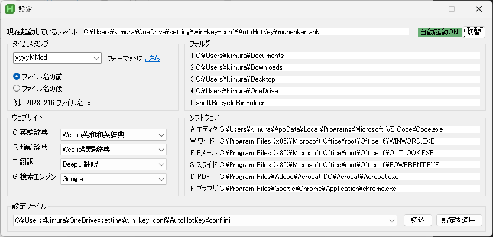

# win-key-conf

Windows のキーボード操作を効率化するプログラムです。
具体的には、AutoHotKey とGoogle 日本語入力、Ctrl2Cap の3 つのソフトウェアを用いて、日本語キーボードにある`無変換キー`と`変換キー`、`CapsLock キー`に異なる機能を与えます。
3 つのソフトはそれぞれ独立しているため、すべてを導入する必要はありません。
個人の好みに合ったソフトだけ使用してください。

## 導入方法
- お手元にGit 環境がある人：  
  クローンしてください。  
  `$ git clone git@github.com:kimushun1101/win-key-conf.git`
- Git 環境がない人：
  1. GitHub ページの`Code<>▼` から`Download ZIP`
  2. `win-key-conf-main.zip` をお好みのフォルダに展開してください。

各ソフトウェアの導入方法については以下を御覧ください。

---

## AutoHotKey
`無変換キー`と他のキーを同時押しすることで様々な動作ができるようになります。
`無変換キー`単体は`無変換キー`として効きます。
現状の機能を消すことなく、覚えやすさを重視してキーボードショートカットを配置しました。
### できること
 

- (青)`無変換キー`+`右手`（両手がホームポジションにあることを想定）
  - `H`, `J`, `K`, `L`: 1文字カーソル移動
  - `U`, `I`: 単語で左右カーソル移動
  - `Y`, `O`: Home、End カーソル移動
  - `N`, `M`, `.` BackSpace, Delete, Esc
- `無変換キー`+`左手`（右手はマウスを操作していることを想定）
  - (黄色)数字キー→エクスプローラーでフォルダを開く ***【設定変更可能】***
    - `1`: ドキュメント
    - `2`: ダウンロード
    - `3`: デスクトップ
    - `4`: OneDrive
    - `5`: ごみ箱
  - (オレンジ)左手上段→選択文字列を検索 ***【設定変更可能】***
    - `Q`: 英単語検索、Weblio英和和英辞典
    - `R`: 類語辞典、Weblio類語辞典
    - `T`: 翻訳、DeepL Translator
    - `G`: Web 検索、Google 検索
  - (赤)左手中段→ソフトを最前面に出す ***【設定変更可能】***
    - `A`: エディタ、VS Code
    - `W`: ワード、Microsoft Word
    - `E`: Eメール、Microsoft Outlook
    - `S`: スライド作成、PowerPoint
    - `D`: ドキュメント閲覧、Adbee Acrobot Reader
    - `F`: ブラウザ、Google Chrome
  - (紫)左手下段→ファイルの操作
    - `V`: ファイル名に最後に編集した日付のタイムスタンプを貼り付け
    - `C`: コピーして、新しくできたファイルの名前に最後に編集した日付のタイムスタンプ貼り付け
    - `X`: 上記で付加したタイムスタンプ切り取り
    - `Z`: タイムスタンプの位置を前に
    - `B`: タイムスタンプの位置を後ろに
- (緑)上記のルールから外れるもの
  - `無変換キー`+`P` : PrintScreen、Alt と一緒に押すことも多いので両手をつかってもよいかなと。
  - `Ctrl` + `Shift` + `V` : 書式なしで貼り付け（エディタソフトは除く）
  - `無変換キー`+`ファンクションキー` : で本スクリプトの便利ショートカット
    - `F1`: 現在の設定とキー配置の画像を表示
    - `F2`: 設定の変更を行うウィンドウを表示
    - `F3`: 最前面のソフト（エクスプローラーの場合はフォルダ）をショートカットキーに割り当て
    - `F4`: スクリプトの終了→スクリプトの保存じているフォルダを開く
    - `F5`: スクリプトを保存して、新しい設定をリロード

### キーの覚え方
- カーソル移動=`HJKL` はVim 準拠
- カーソル移動=`YUIO` はキーの位置と横移動の大きさを関連付けています。
- 文字消去=`NM` は両方とも人差し指で操作する。位置関係はカーソルが動く方向に対応しています。
- `Esc`=`.` は終了を意味することから連想しています。
- Web サイトやソフトはおおよそ推測できる割当になっているかと思います。例外としては以下のとおりです。
  - 英単語=`Q` はQuestion から連想します。
  - エディタ=`A` はAtom を使っていたからです。
  - ブラウザ=`F` はFireFox を使っていたからです。
- タイムスタンプの操作=`XCV` は、切り取り、コピー、ペーストなどを連想して覚えてください。
- タイムスタンプ位置の変更=`ZB` は、`Z`(左=ファイル名の前)`B`(右=ファイル名の後) という具合で位置に対応。

#### 選択文字列を検索

#### ソフトを最前面に出す(ソフトの切り替え)

### 導入方法

1. `AutoHotKey\muhenkan.exe` を実行する。
2. `無変換キー`+`F2` で設定を確認して、好みの設定に変更。
  - 自動起動ON に切り替えるとWindows 立ち上げ時にこのソフトが自動起動するようになります。
  - 好みのウェブサイトが選択肢にない場合には追加しますので教えていただけますと幸いです。
  - フォルダはパスをクリックして編集することができますが、エクスプローラを最前面に出して`無変換キー`+`F3` で変更することもできます。
  - 設定画面上では変更できません。設定したいソフトウェアを最前面に出して`無変換キー`+`F3` で変更してください。
  - 設定ファイルは以下の3つを選択肢として用意しております。
    - `conf.ini` : 起動時の設定。`設定の適用` を押すと現在の項目が保存されて再起動されます。
    - `backup.ini` : 個人的な設定をバックアップするために使います。Git の追跡から外しております。他の名前で作りたい場合には`Another File` を選択してください。
    - `default.ini` : 初期設定。`読込` のみ可能で、このファイルの書き換えはできないようにしています。

### ソースコードを編集したい場合
1. https://www.autohotkey.com/ ここのDownload からv2.0 を選択してインストール
2. `AutoHotKey\muhenkan.ahk` を編集して実行
3. デバッグには`無変換キー`+`F5` が便利
4. AutoHotkey アプリを立ち上げ、AutoHotKeyDash のCompile からexe ファイルを作成可能

## Google 日本語入力
日本語入力をサポートするソフトウェアです。
`GoogleIME\henkan_muhenkan.txt` は、私が使っている設定をGoogle 日本語入力でエクスポートしたものです。
### できること
- 設定する機能
  - `無変換キー`でIME オフ
  - `変換キー`でIME をオン
    - 入力中に`無変換キー`で半角に変換
    - 変換中に`BackSpace` で変換前に戻る
- Google 日本語入力自体の機能
  - (重要)以上の設定をテキストファイルにエクスポート or インポート
  - 方向キーが簡単に出せる
    - （日本語入力で）`zh` : ←
    - `zj` : ↓
    - `zk` : ↑
    - `zl` : →
  - 他にも様々な機能がありますので、ご興味のある方は調べてみてください。
    
### 導入方法
1. https://www.google.co.jp/ime/
ここからダウンロードしてインストール
2. タスクバーの時刻付近にある(デフォルトのMS IME を使用していた場合)`J`のアイコンをクリックしてGoogle 日本語入力に切り替え
3. `A`または`あ` のアイコンを右クリックしてプロパティをクリック
4. `キーの設定の選択`→`編集…`をクリック
5. `編集▼`から`インポート`をクリック
6. `GoogleIME\henkan_muhenkan.txt` を選択

## Ctrl2Cap
`CapsLock キー`を`Ctrl キー`に置き換えることができるソフトウェアです。
本当はAutoHotKey スクリプトで実現したかったのですが、日本語キーボードでは難しかったのでこちらで設定しました。
解決できる方がおりましたらPull Request、もしくはSNS などで教えてください。
### 導入方法
1. https://learn.microsoft.com/ja-jp/sysinternals/downloads/ctrl2cap
公式のホームページで内容を確認
2. `Ctrl2Cap\install_Ctrl2Cap.cmd` を右クリック→「管理者として実行」
3. Ctrl2cap successfully installed. You must reboot for it to take effect. と出ていたら再起動

---

## 設定を戻す・アンイストール
お好みの状態まで段階的に戻せます。
### AutoHotKey
1. 自動起動を停止：`無変換キー`+`F2 キー` から設定
2. スクリプトの停止：`無変換キー`+`F4 キー` を押下
3. AutoHotKey 自体のアンイストール：Windows の設定→アプリと機能からAutoHotKeyを選択してアンイストール
### Google 日本語入力
1. キー設定をMicrosoft IME に戻す：導入方法5. の`編集▼`の`定義済みのキーマップからインポート`から`MS-IME`をクリック
2. Microsoft IME 自体に戻す： タスクバーの時刻付近にある青い丸のアイコンをクリックしてMicrosoft IME に切り替え
3. Google 日本語入力自体のアンイストール：Windows の設定→アプリと機能からGoogle 日本語入力を選択してアンイストール
### Ctrl2Cap
1. `Ctrl2Cap\uninstall_Ctrl2Cap.cmd` を右クリック→「管理者として実行」
2. Ctrl2cap uninstalled. You must reboot for this to take effect. と出ていたら再起動

---

## ライセンス
AutoHotKey のスクリプトファイル(.ahk) は、公式のサンプルを参考にしているため、GNU GPLv2 とします。
その他のファイルも、とりあえずGNU GPLv2 としますが、変更の要望があればデュアルライセンスなども検討します。
各ソフトウェアのライセンスについては、各々の公式ページをご参照ください。
- AutoHotKey : https://www.autohotkey.com/docs/v2/license.htm
- Googole日本語入力：https://policies.google.com/terms
- Ctrl2Cap : https://learn.microsoft.com/ja-jp/sysinternals/license-terms
