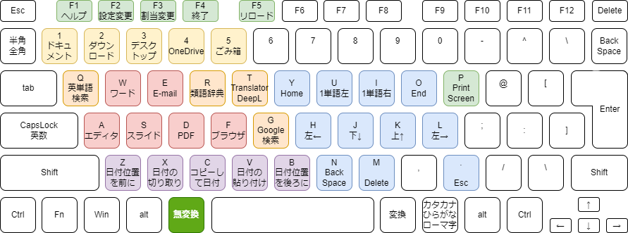
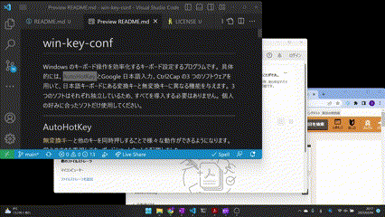

# win-key-conf

Windows のキーボード操作を効率化するプログラムです。
具体的には、AutoHotKey とGoogle 日本語入力、Ctrl2Cap の3 つのソフトウェアを用いて、日本語キーボードにある`無変換キー`と`変換キー`、`CapsLock キー`に異なる機能を与えます。
3 つのソフトはそれぞれ独立しているため、すべてを導入する必要はありません。
個人の好みに合ったソフトだけ使用してください。

## 導入方法
- お手元にGit 環境がある人：  
  クローンしてください。  
  `$ git clone git@github.com:kimushun1101/win-key-conf.git`
- Git 環境がない人：
  1. GitHub ページの`Code<>▼` からDownload ZIP
  2. `win-key-conf-main.zip` をお好みのフォルダに展開してください。

各ソフトウェアの導入方法については以下を御覧ください。

---

## AutoHotKey
`無変換キー`と他のキーを同時押しすることで様々な動作ができるようになります。
`無変換キー`単体は`無変換キー`として効きます。
現状の機能を消すことなく、覚えやすさを重視してキーボードショートカットを配置しました。
### できること
 

- (青)`無変換キー`+`右手`（両手がホームポジションにあることを想定）
  - `h`, `j`, `k`, `l`: 1文字カーソル移動
  - `u`, `i`: 単語で左右カーソル移動
  - `y`, `o`: Home、End カーソル移動
  - `n`, `m`, `.` BackSpace, Delete, Esc
- `無変換キー`+`左手`（右手はマウスを操作していることを想定）
  - (黄色)数字キー→エクスプローラーでフォルダを開く
    - `1`: ドキュメント
    - `2`: ダウンロード
    - `3`: デスクトップ
    - `4`: OneDrive
    - `5`: ごみ箱
  - (オレンジ)左手上段→選択文字列を検索
    - `g`: Google 検索
    - `t`: DeepL Translator 検索
    - `r`: 類語辞典
    - `e`: E-Commerce アマゾン検索
    - `w`: weblio 英単語検索
    - `q`: 論文検索 Google Scholar
  - (赤)左手中段→ソフトを最前面に出す
    - `a`: エディタ、VS Code
    - `s`: スライド作成、PowerPoint
    - `d`: ドキュメント閲覧、Adbee Acrobot Reader
    - `f`: ブラウザ、Google Chrome
  - (紫)左手下段→ファイルの操作
    - `v`: ファイル名に最後に編集した日付のタイムスタンプを貼り付け
    - `c`: コピーして、新しくできたファイルの名前に最後に編集した日付のタイムスタンプ貼り付け
    - `x`: 上記で付加したタイムスタンプ切り取り
    - `z`: zip ファイルの解凍
    - `b`: zip 圧縮
- (緑)上記のルールから外れるもの
  - `無変換キー`+`p` : PrintScreen、Alt と一緒に押すことも多いので両手をつかってもよいかなと。
  - `Ctrl` + `Shift` + `v` : 書式なしで貼り付け（エディタソフトは除く）
  - `無変換キー`+ファンクションキーで本スクリプトの便利ショートカット
    - `F1`: キー配置の画像を表示
    - `F2`: 自動起動のオンオフ（このフォルダの場所を変えた場合には都度行ってください。）
    - `F4`: スクリプトの終了→スクリプトの保存じているフォルダを開く
    - `F5`: スクリプトを保存して、新しい設定をリロード

### キーの覚え方
- カーソル移動=HJKL はVim 準拠
- カーソル移動=YUIO はキーの位置と横移動の大きさを関連付けています。
- 文字消去=NM は両方とも人差し指で操作する。位置関係はカーソルが動く方向に対応しています。
- Esc=. は終了を意味することから連想しています。
- Web サイトやアプリはおおよそ連想できるような言葉を用意しています。例外としては以下のとおりです。
  - エディタ=A はAtom を使っていたからです。
  - ブラウザ=F はFireFox を使っていたからです。
  - 論文検索=Q は、Articles Search の頭文字A の上と覚えてます。
  - Zip 圧縮=B は、ごめんなさい、空いている場所で決めました。
- タイムスタンプの操作=XCV は、切り取り、コピー、ペーストなどを連想して覚えてください。
- その他、覚えにくいものがあればご意見ください。

#### 選択文字列を検索

#### ソフトを最前面に出す(ソフトの切り替え)

### 導入方法
1. https://www.autohotkey.com/
ここのDownload からv2.0 を選択してインストール
2. `AutoHotKey\muhenkan.ahk` をダブルクリック
3. Windows 立ち上げ時に自動起動したい場合、muhenkan_base.ahk が起動した状態で`無変換キー`+`F2 キー` を押下(もう一度押すと解除も可能)
### スクリプトの編集
- 好みのソフトウェアやWeb サイト、タイムスタンプ付加ルールがある場合には、`AutoHotKey\conf.ini` をテキストエディタで書き換えてから`AutoHotKey\muhenkan.ahk` を(再)実行してください。
  - 該当箇所のコメントアウトを読めば、AutoHotKey の文法がわからなくても書き換えられると思います。
  - オススメのソフトやサイトがあれば追加します。気軽にPull Request をいただけますと助かります。
  - 需要が高ければ設定のGUI を作ってもよいかなと考えています。
- 設定ファイルやスクリプトを編集・デバッグしたい場合には、`無変換キー`+`F5 キー` が便利です。
- 図はDraw.io（diagrams.net）を使用して作成しています。[VS Code の拡張機能](https://marketplace.visualstudio.com/items?itemName=hediet.vscode-drawio)もあります。
- 他にも色々なことができますが、以下の観点から機能を厳選しています。
  - たくさんの機能を盛り込むことで、学習コストや使い勝手が悪くなってしまうことを懸念。
  - そもそも自分で追加したにもかかわらず使わない機能もたくさんありました。
  - キーボードが変わってもタッチタイピングができるキーは結局それを使ってしまいます。例えば`;` や`.` にEnter を仕込んでみたりもしましたが、やはりEnter はEnter キーを押しやすいです。
  - 変換キーをホットキーとするとIMEオン（日本語入力）に直後のタイピングで誤作動しやすいので、日本語入力で使う母音と子音のキーは避けたほうがさそうです。例えば`変換キー`+`a` や`変換キー`+`s` などはたくさん暴発してきました。
- とはいえ、**Windows でよく使う機能や動作がご提案頂けますと嬉しいです。機能追加の検討はさせてください。**

## Google 日本語入力
日本語入力をサポートするソフトウェアです。
`GoogleIME\henkan_muhenkan.txt` は、私が使っている設定をGoogle 日本語入力でエクスポートしたものです。
### できること
- 設定する機能
  - 無変換キーでIME オフ
  - 変換キーでIME をオン
    - 入力中に無変換キーで半角に変換
    - 変換中にBackSpace で変換前に戻る
- Google 日本語入力自体の機能
  - (重要)以上の設定をテキストファイルにエクスポート or インポート
  - 方向キーが簡単に出せる
    - （日本語入力で）`zh` : ←
    - `zj` : ↓
    - `zk` : ↑
    - `zl` : →
  - 他にも様々な機能がありますので、ご興味のある方は調べてみてください。
    
### 導入方法
1. https://www.google.co.jp/ime/
ここからダウンロードしてインストール
2. タスクバーの時刻付近にある(デフォルトのMS IME を使用していた場合)`J`のアイコンをクリックしてGoogle 日本語入力に切り替え
3. `A`または`あ` のアイコンを右クリックしてプロパティをクリック
4. `キーの設定の選択`→`編集…`をクリック
5. `編集▼`から`インポート`をクリック
6. `GoogleIME\henkan_muhenkan.txt` を選択

## Ctrl2Cap
Caps Lock キーをCtrl キーに置き換えることができるソフトウェアです。
本当はAutoHotKey スクリプトで実現したかったのですが、日本語キーボードでは難しかったのでこちらで設定しました。
解決できる方がおりましたらPull Request、もしくはSNS などで教えてください。
### できること
同上
### 導入方法
1. https://learn.microsoft.com/ja-jp/sysinternals/downloads/ctrl2cap
公式のホームページで内容を確認
2. `Ctrl2Cap\install_Ctrl2Cap.cmd` を右クリック→「管理者として実行」
3. Ctrl2cap successfully installed. You must reboot for it to take effect. と出ていたら再起動

---

## 設定を戻す・アンイストール
お好みの状態まで段階的に戻せます。
### AutoHotKey
1. 自動起動を停止：スクリプトが起動している状態で`無変換キー`+`F2 キー` を押下
2. スクリプトの停止：`無変換キー`+`F4 キー` を押下
3. AutoHotKey 自体のアンイストール：Windows の設定→アプリと機能からAutoHotKeyを選択してアンイストール
### Google 日本語入力
1. キー設定をMicrosoft IME に戻す：導入方法5. の`編集▼`の`定義済みのキーマップからインポート`から`MS-IME`をクリック
2. Microsoft IME 自体に戻す： タスクバーの時刻付近にある青い丸のアイコンをクリックしてMicrosoft IME に切り替え
3. Google 日本語入力自体のアンイストール：Windows の設定→アプリと機能からGoogle 日本語入力を選択してアンイストール
### Ctrl2Cap
1. `Ctrl2Cap\uninstall_Ctrl2Cap.cmd` を右クリック→「管理者として実行」
2. Ctrl2cap uninstalled. You must reboot for this to take effect. と出ていたら再起動

---

## ライセンス
AutoHotKey のスクリプトファイル(.ahk) は、公式のサンプルを参考にしているため、GNU GPLv2 とします。
その他のファイルも、とりあえずGNU GPLv2 としますが、変更の要望があればデュアルライセンスなども検討します。
各ソフトウェアのライセンスについては、各々の公式ページをご参照ください。
- AutoHotKey : https://www.autohotkey.com/docs/v2/license.htm
- Googole日本語入力：https://policies.google.com/terms
- Ctrl2Cap : https://learn.microsoft.com/ja-jp/sysinternals/license-terms
